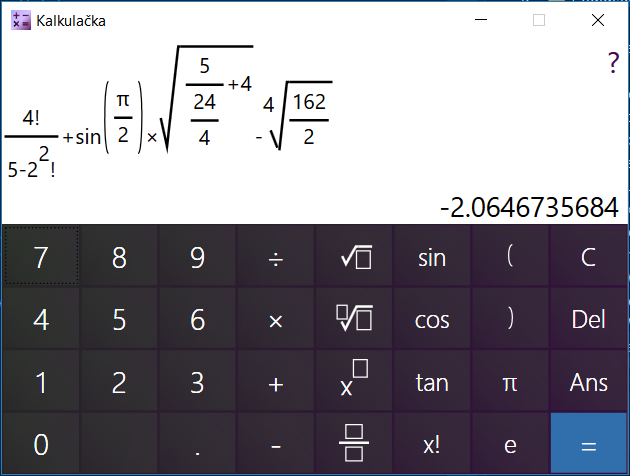

<h1 align="center">Calculator</h1>

<h2>IVS Project 2</h2>
A basic calculator with GUI, including math library, installer, docs, tests and other details

Platforms
---------

Windows 10 64bit

Authors
------

PepeHands
- xhajek48 Karel Hajek 
- xondri07 Ladislav Ondris
- xrosin00 Monika Rosinska
- xrozsi06 Michal Rozsival

Licence
-------

This project is licensed under the GNU GPL v.3 License.
